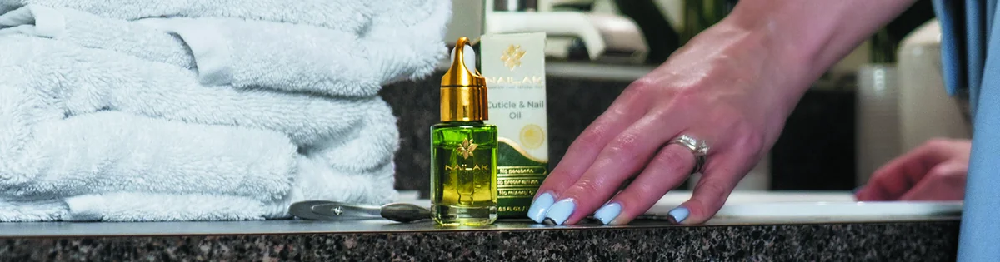
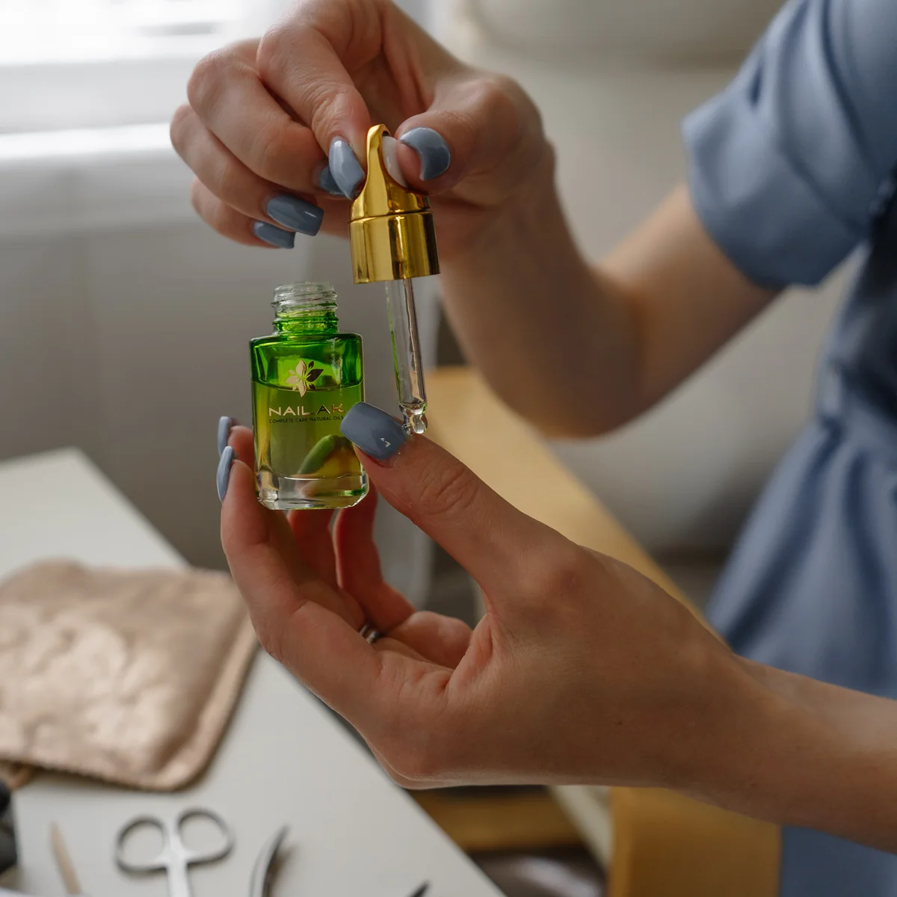
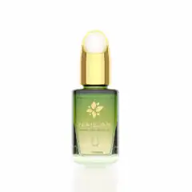
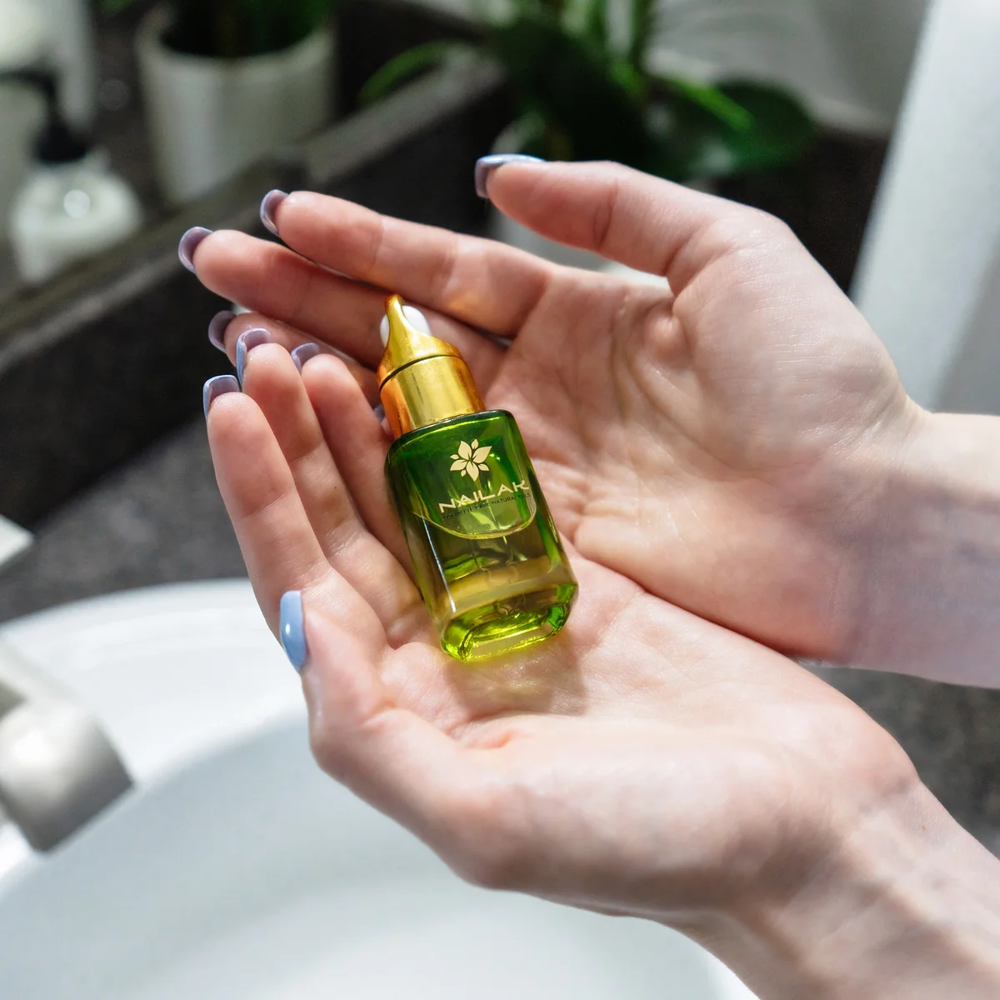
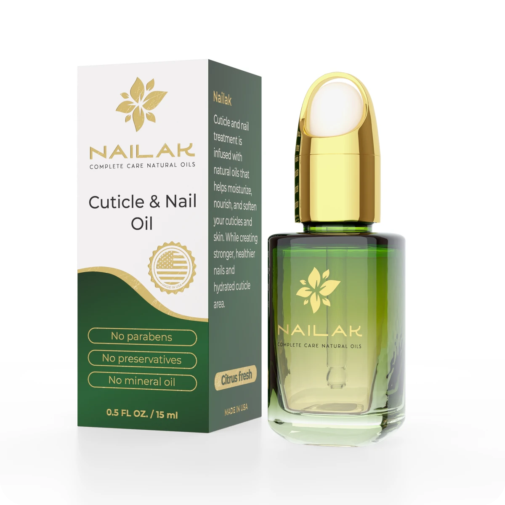

<link rel="stylesheet" href="cuticle-oil.css">

<main class="nko-container">

<!-- 🩵 HERO -->
<section class="nko-section nko-hero" aria-label="Nailak Cuticle & Nail Oil">
  
  

    
Cuticle & Nail Care

    <h1 class="nko-h1">Nailak Cuticle & Nail Oil</h1>
    
Restore strength, shine, and hydration in just two weeks — lightweight, fast-absorbing, and naturally effective.

    

      <a class="nko-btn" href="https://nailak.com/products" target="_blank" rel="noopener">Shop Now →</a>
      Vegan • Cruelty-Free • Made in USA
    

  

</section>

<!-- 💅 LIFESTYLE -->
<section class="nko-section" aria-label="Everyday care moments">
  <h2 class="nko-h2">A Moment of Care, Every Day</h2>
  
Each drop is a spa-like touch — absorbs quickly, leaving comfort and a natural glow. Perfect for your daily nail routine.

  

    

    

    

  

</section>

<!-- 🌿 BENEFITS -->
<section id="benefits" class="nko-section anchor" aria-label="Benefits">
  <h2 class="nko-h2">Why Your Nails Will Love It</h2>
  

    

Deep Hydration

Revives dry cuticles and locks in lasting moisture.

    

Natural Shine

Restores healthy, salon-like glow.

    

Stronger Nails

Helps reduce breakage and brittleness.

    

Clean Formula

No parabens, preservatives, or mineral oils.

  

  <h3 class="nko-h3">Key Natural Ingredients</h3>
  
Jojoba • Almond • Apricot Kernel • Squalane

</section>

<!-- 🎥 VIDEO -->
<section id="video" class="nko-section anchor" aria-label="How to apply">
  <h2 class="nko-h2">How to Apply</h2>
  

    

      <h3 class="nko-h3">Step-by-Step Guide</h3>
      <ol class="nko-lead" style="margin-left:18px">
        <li>Apply one small drop to each nail.</li>
        <li>Massage gently into cuticles and nail bed.</li>
        <li>Use daily for visible results in 14 days.</li>
      </ol>
      

        <a class="nko-btn" href="https://nailak.com/products" target="_blank" rel="noopener">Shop Now →</a>
      

    

    

      <iframe src="https://www.youtube.com/embed/IrEHjlXch_0"
              title="Nailak Cuticle & Nail Oil — how to use"
              frameborder="0"
              allow="accelerometer; autoplay; clipboard-write; encrypted-media; gyroscope; picture-in-picture; web-share"
              allowfullscreen></iframe>
    

  

</section>

<!-- 🌸 INGREDIENTS -->
<section id="ingredients" class="nko-section anchor" aria-label="Ingredients">
  <h2 class="nko-h2">What’s Inside</h2>
  
A balanced blend designed to nourish, protect and restore.

  <ul class="nko-lead">
    <li><strong>Jojoba Oil</strong> — softens cuticles, mimics skin’s natural sebum.</li>
    <li><strong>Squalane</strong> — locks in moisture without heaviness.</li>
    <li><strong>Sweet Almond & Apricot Kernel Oils</strong> — add flexibility and shine.</li>
    <li><strong>Vitamin E & B complex</strong> — antioxidant support for stronger nails.</li>
  </ul>
</section>

<!-- ✨ FINAL CTA -->
<section class="nko-section nko-cta">
  
  

    <h2 class="nko-h2">Ready to Restore Your Natural Glow?</h2>
    
Turn a simple daily moment into real nail care. Lightweight, fast-absorbing, beautifully effective.

    

      <a class="nko-btn" href="https://nailak.com/products" target="_blank" rel="noopener">Shop Now →</a>
    

    

      Vegan
      Cruelty-Free
      Made in USA
    

  

</section>

Results may vary. Always patch test before first use.

</main>

